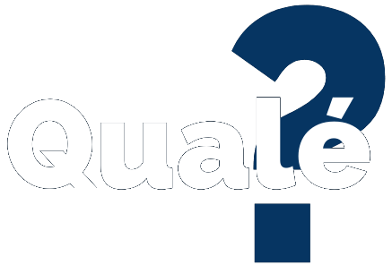

  

<h3 align="center">Qualé? (Em desenvolvimento)</h3>

---

## 🧐 Sobre

Qualé? Um projeto experimental que criei principalmente para entender o funcionamento do Gatsby com uma REST api, do Reakit e ThemeUI.
O intuito é trabalhar com a API de Filmes disponibilizada pelo [TheMovieDB](https://www.themoviedb.org/) para exibir informações interessantes, além de treinar a construção de um site acessível, responsivo e rápido com a Stack escolhida.

## ⛏️ Tecnologias Usadas 

- [ReactJS](https://pt-br.reactjs.org/) - Framework Web
- [GatsbyJS](https://www.gatsbyjs.com/) - Framework Web
- [Reakit](https://reakit.io/) - Framework Web
- [Theme-UI](https://theme-ui.com/) - Framework Web
- [TheMovieDB](https://www.themoviedb.org/) - API REST gratuíta de Filmes

## 📸 Screenshots

---

---

